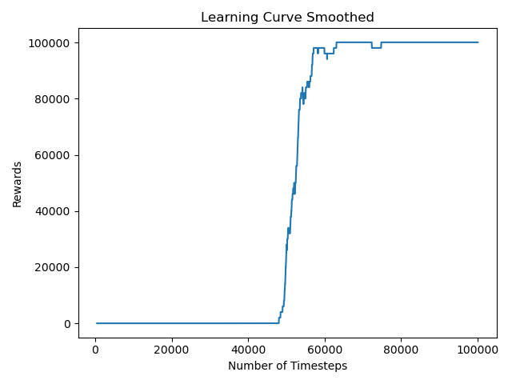

# UAV Coverage Path Planning for single/multi drones

This program is for planing coverage path for a single or multiple drones on a discrete gridworld.

*2 Drones Coverage Path Animation*

*Training Plot over Episode of 2 drones on 10x10 Feild*

## Installation

- Install [stable-baseline](https://stable-baselines.readthedocs.io/en/master/index.html)
  - Baselines requires python3 (>=3.5) with the development headers. You’ll also need system packages CMake, OpenMPI and zlib. Those can be installed as follows.
  - Stable-Baselines supports Tensorflow versions from 1.8.0 to 1.15.0, and does not work on Tensorflow versions 2.0.0 and above.
  - `pip install stable-baselines`
- Install tabulate
  - `pip install tabulate`
  
 
## Training

- Import the specific environment in traning.py
- `python3 training.py`
